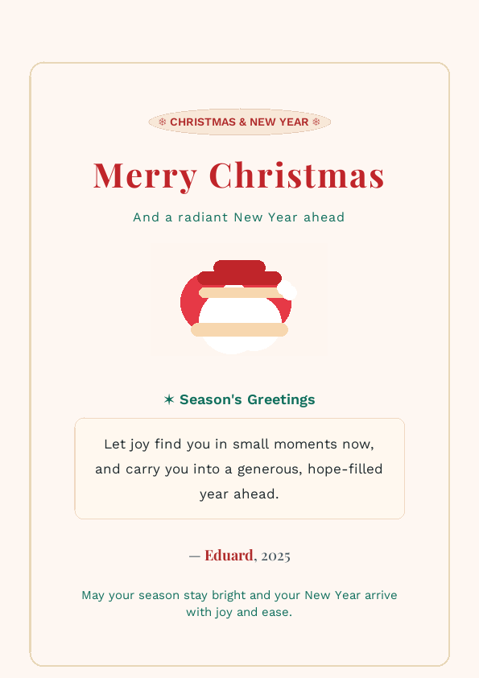

# 🎄 Xmas Card (Quarkus + Renarde)

Generates a festive Christmas card as either HTML or PNG. Content can be supplied via query params or auto-filled with warm defaults.



## Quick start
- Dev mode with live reload: `cd xmas-card && ./mvnw quarkus:dev`
- HTML card: http://localhost:8080/christmasHtmlCard
- PNG card:  http://localhost:8080/christmasPngCard

### Customizing the card text (optional)
All params are optional; missing values are auto-filled from `util.WishFactory`:
```
/christmasHtmlCard?recipient=Team&message=Thanks%20for%20a%20great%20year!&sender=Alex&year=2025
/christmasPngCard?recipient=Mom&message=You%20are%20the%20heart%20of%20our%20home&sender=Sam&year=2024
```

## What’s inside
- Renarde controller: `xmas-card/src/main/java/rest/Application.java`
  - `/christmasHtmlCard` → HTML view
  - `/christmasPngCard` → same view rendered to PNG
- Template: `xmas-card/src/main/resources/templates/Application/christmasCard.html` (PDF-friendly CSS)
- Wish factory with curated seasonal messages: `xmas-card/src/main/java/util/WishFactory.java`
- Embedded fonts and illustration served locally from `xmas-card/src/main/resources/META-INF/resources/`.

## Production build
- Package: `cd xmas-card && ./mvnw package`
- Run JAR: `java -jar xmas-card/target/quarkus-app/quarkus-run.jar`
- Native (optional): `cd xmas-card && ./mvnw package -Dnative`

Enjoy and share the cheer! 🎁
